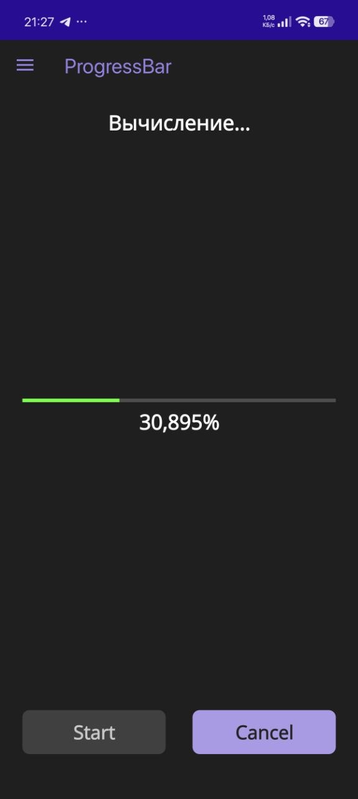
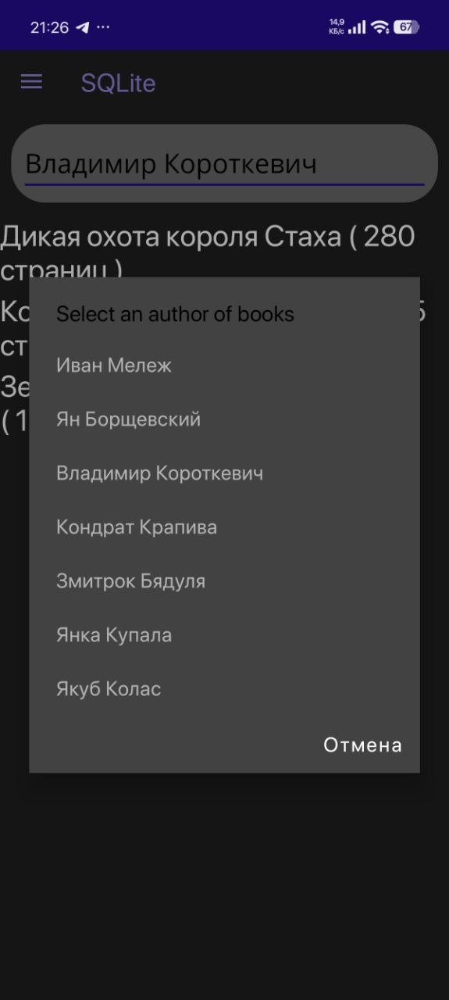
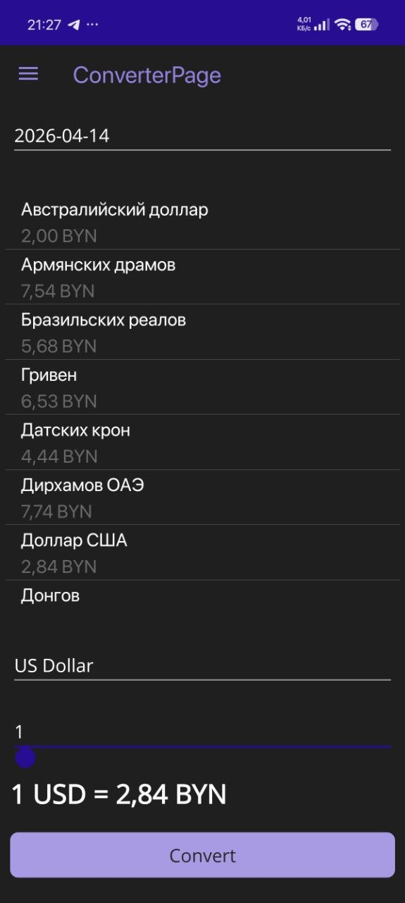

Лабораторные работы 4–6: .NET MAUI приложение «Калькулятор + База данных + Конвертер валют»
📱 О проекте
Проект представляет собой мобильное приложение, разработанное на фреймворке .NET MAUI с использованием XAML. Реализован функционал калькулятора, работа с локальной базой данных (SQLite) и получение курсов валют из открытого API.

🔬 Лабораторная работа №4 – Управление UI из вторичного потока
Цель: научиться управлять интерфейсом из вторичного потока.

Реализовано:

Асинхронное вычисление интеграла функции sin(x) на отрезке от 0 до 1 методом прямоугольников.

Отображение прогресса вычисления через ProgressBar и текстовый процент.

Кнопка Start – запуск вычислений с использованием async/await.

Кнопка Cancel – отмена вычислений с помощью CancellationToken.

Динамическое изменение текста:

«Вычисление» – во время работы;

результат интеграла – по завершении;

«Задание отменено» – при отмене.

 

🗄️ Лабораторная работа №5 – Работа с базой данных
Цель: знакомство с ORM SQLite.Net, сохранение и отображение данных.

Индивидуальное задание: Авторы – книги

Реализовано:

Созданы сущности:

Author (группа) – таблица авторов;

Book (объект) – таблица книг с привязкой к автору (связь один-ко-многим).

Реализован сервис IDbService / SQLiteService:

получение списка всех авторов;

получение списка книг выбранного автора;

создание и начальное заполнение БД (2–4 автора, 5–10 книг у каждого).

Страница с Picker для выбора автора и CollectionView для отображения списка книг.

Загрузка групп – по событию Loaded, книг – по SelectedIndexChanged.

Внедрение зависимостей через MauiProgram (Transient).

 

💱 Лабораторная работа №6 – Работа с REST API сервисом
Цель: получение, обработка и отображение данных из веб-сервиса.

Реализовано:

Страница «Конвертер валют» с использованием API Национального банка РБ.

Отображаются курсы на выбранную дату для валют:

Российский рубль, Евро, Доллар США, Швейцарский франк, Китайский юань, Фунт стерлингов.

Выбор валюты для конвертации.

Пересчёт суммы:

из белорусских рублей → в выбранную валюту;

из выбранной валюты → в белорусские рубли.

Реализован сервис IRateService / RateService с HttpClient.

Внедрение HttpClientFactory в MauiProgram.

 